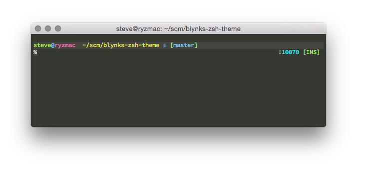

# blynks-zsh-theme

Blynks, a [Zsh](http://www.zsh.org/) theme based on Blinks, which comes with the [oh-my-zsh](https://github.com/robbyrussell/oh-my-zsh) framework.

Changes:
  * Show the vi-mode on the right side of the prompt
  * Slightly slimmed down prompt
  * Some colors have been changed

## Installation
Clone this repo, copy the blynks.zsh-theme file into your $ZSH\_CUSTOM directory and set your theme to blynks in your .zshrc.

